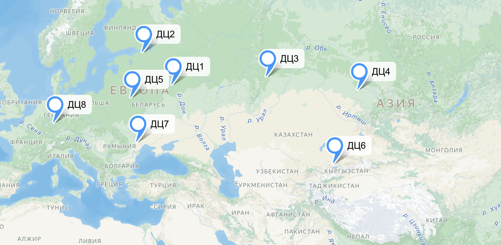

# VK музыка

## 1. Тема и целевая аудитория

VK музыка - российский стриминговый сервис компании VK, объединяющий музыкальную платформу «ВКонтакте» и отдельное приложение для прослушивания музыки.

### Функционал MVP

1. Аутентификация пользователей
2. Поиск и нахождение музыки
3. Прослушивание и воспроизведение музыки
4. Добавление треков в плейлист
5. Создание и редактирование плейлистов
6. История прослушиваний пользователя

### Целевая аудитория

#### Анализ трафика и вовлеченности
* MAU - **42млн** [^1]
* DAU - **5-10млн** [^1]
* Средняя продолжительность сессии - **00:02:17** [^2]
* Среднее количество страниц на посещение - **1,90** [^2]
* Среднее количество новых пользователей в месяц - **1 млн** [^2]

#### Веб-трафик по странам

 [^2]

#### Демографические показатели

Общая характеристика аудитории (гендер и возраст) [^2]

 

## 2. Расчет нагрузки

### Продуктовые метрики

| Метрика                  | Значение         | Источник/Формула                              |
|--------------------------|------------------|-----------------------------------------------|
| **MAU**                  | 42M             | [Пресс-релиз VK](RUS_Press_Release_9M_2024.pdf) |
| **DAU**                  | 5-10M           | [Пресс-релиз VK](RUS_Press_Release_9M_2024.pdf) |
| **Хранилище:**           |                  |                                               |
| - Треки/пользователь             | 100              | [Spotify-аналог](https://newsroom.spotify.com/company-info/)                               |
| - Метаданные/пользователь        | 0.01 ГБ        | `100 треков × 0.1 МБ` [Расчет](#meta)                              |
| **Действия/день:**       |                  |                                               |
| - Поиск                  | 3-5             | [Spotify-аналог](https://www.vox.com/2014/8/18/6003271/why-are-songs-3-minutes-long)                               |
| - Прослушивание          | 12 тр        | [Расчет](#audio-calc)                         |
| - Добавление в плейлист  | 1             | `1 добавление/12 прослушиваний`                      |

---

#### Метаданные {#meta}
| Компонент              | Размер на 1 трек | Размер на 100 треков |
|------------------------|------------------|----------------------|
| **ID трека**           | 16 B             | 1.6 КБ               |
| **Текстовые данные**   | 400 B            | 40 КБ                |
| **Обложка**            | 80 КБ            | 8 МБ                 |
| **Теги**               | 100 B            | 10 КБ                |
| **Дата добавления**    | 8 B              | 0.8 КБ               |
| **Дополнительные данные** | 19.5 КБ       | 1.95 МБ              |
| **Итого**              | **100 КБ (0.1 МБ)** | **10 МБ (0.01 ГБ)** |

#### Прослушивание треков {#audio-calc}
1. `3-5 сессий × 2:17 мин = 6.8-11.4 мин/день`  
2. `(6.8 мин ÷ 4 мин/трек) + (11.4 ÷ 3) = 1.7(минимум)-3.8(максимум) треков`  
3. **С переключениями треков**: ` в среднем 12 треков/день`

## Технические метрики

### Хранилище
| Тип данных              | Единицы      | Объем (ТБ) | Формула расчета                     |
|-------------------------|--------------|------------|--------------------------------------|
| **Аудиофайлы**          | 50 млн треков| 250        | `5 МБ/трек × 50M`                   |
| **Метаданные треков**   | 50 млн запис.| 5          | `0.1 МБ/трек × 50M`                 |
| **Профили пользователей**| 42 млн аккаунтов | 4.2    | `100 КБ/пользователь × 42M`                 |

---

### Сетевые показатели

#### Пиковая нагрузка (Гбит/с)
| Тип трафика       | Значение | Формула                                |
|--------------------|----------|----------------------------------------|
| Аудиопотоки       | 128      | `1M потоков × 128 кбит/с`              |
| API-запросы       | 10       | `10k RPS × 1 КБ/запрос × 8 бит`        |

**Пояснения:**  
- **1M потоков**: 10% от DAU (10M) одновременно слушают музыку.  
- **128 кбит/с**: [Битрейт аудио для среднего качества ](https://support.spotify.com/md-ru/article/high-quality-streaming/).  
- **10k RPS**: Пиковые запросы к API (поиск, плейлисты, аутентификация).

#### Суточный трафик (ТБ/день)
| Тип трафика       | Значение | Формула                                |
|--------------------|----------|----------------------------------------|
| Аудио             | 600      | `10M DAU × 12 треков × 5 МБ`           |
| API               | 1        | `100M запросов × 10 КБ`                |

---

**Пояснения:**  
- **12 треков/день**: Из продуктовых метрик (прослушивание).  
- **5 МБ/трек**: Средний размер трека ~ 4.8 мб (4 минуты при 128 кбит/c).  

### Производительность (RPS)

Средний RPS = Общее кол-во запросов в день / 86,400  
Пиковый RPS = Средний RPS × 2 (коэффициент пиковой нагрузки)

| Метод                     | Средний | Пиковый  | Формула расчета              |
|---------------------------|---------|----------|-------------------------------|
| **Поиск**                | 580     | 1,160    | `50M/86400 × 2`             |
| **Воспроизведение**      | 694   | 1,388   | `120M/86400 × 2`            |
| **Добавление в плейлист**| 116     | 232    | `10M/86400 × 2`             |
| **Аутентификация**       | 116     | 232    | `10M/86400 × 2`             |
| **Управление плейлистами**| 69     | 138      | `6M/86400 × 2`              |
| **Запись истории**       | 694  | 1,388   | `120M/86400 × 2`            |

---

**Пояснения:**  
- **Поиск (50M/день)**:  
  `10M DAU × 5 запросов/день` (аналогия с Spotify).  
- **Воспроизведение (120M/день)**:  
  `10M DAU × 12 треков/день` (из продуктовых метрик).  
- **Добавление в плейлист (10M/день)**:  
  `10M DAU × 1 добавление/день (1 сохранение на 12 прослушиваний).  
- **Аутентификация (10M/день)**:  
  Каждый DAU выполняет 1 вход в день.  
- **Управление плейлистами (6M/день)**:  
  `42M MAU / 7 дней` (пользователи редактируют плейлисты в среднем раз в неделю).  
- **Запись истории (120M/день)**:  
  Сохранение каждого прослушивания: `10M DAU × 12 треков`.  

**Примечания:**  
1. **Коэффициент ×2 для пика** — обоснован географическим распределением пользователей и разницей в часовых поясах. Сервис охватывает территорию СНГ, где пользователи находятся в разных часовых поясах (от UTC+2 до UTC+12). Пиковая нагрузка распределяется во времени: когда в одном регионе вечер (пик активности), в другом — утро или день (низкая активность). Таким образом, пиковая нагрузка в целом по системе не превышает [2-кратного значения](https://habr.com/en/companies/dcmiran/articles/496542/) от средней.

2. **86,400** — количество секунд в сутках (`24 × 60 × 60`).  

## 3. Глобальная балансировка нагрузки

### 1. Функциональное разбиение по доменам

Для VK Музыки функциональное разбиение сосредоточено на основном домене:

- **Основной домен**: `music.vk.com` - домен используется для всех функций сервиса.

### 2. Обоснование расположения ДЦ (влияние на продуктовые метрики)

#### Основные регионы пользователей

На основе данных о трафике, основными регионами, где сосредоточена аудитория VK Музыки, являются:
- **Россия**: 48.47% трафика
- **Беларусь**: 15.09% трафика
- **Казахстан**: 14.18% трафика
- **Молдова**: 8.68% трафика
- **Германия**: 3.12% трафика

Эти пять регионов генерируют более 90% всего трафика сервиса. Это значит, что именно здесь сосредоточено большинство пользователей, и здесь нужно размещать ДЦ.

#### Расчет количества серверов

1. **Пиковая нагрузка**:  
   - **Аудиопотоки**: 128 Гбит/с.  
   - **API-запросы**: 10k RPS.  

2. **Мощность одного сервера**:  
   - Сервер средней мощности (8 vCPU, 32GB RAM) может выдавать примерно 300 Мбит/с.

3. **Общее количество серверов**:  
   - Пиковое потребление в сутки: 128 Гбит/с.  
   - Количество серверов:  
     - 1 Гбит = 1024 Мбит, поэтому 128 Гбит/с = 128 × 1024 = 131072 Мбит/с.  
     - Мощность одного сервера: 300 Мбит/с.  
     - Количество серверов = 131072 Мбит/с / 300 Мбит/с ≈ 437 серверов.  
     - С запасом х2: 437 × 2 = 874 сервера.

#### Распределение серверов по ДЦ

Распределим серверы по ДЦ в соответствии с количеством пользователей в каждом регионе:

| Регион       | Доля трафика | Количество серверов | Расположение ДЦ         |
|--------------|--------------|---------------------|-------------------------|
| **Россия**   | 48.47%       | 424                 | Москва, Санкт-Петербург, Екатеринбург, Новосибирск |
| **Беларусь** | 15.09%       | 132                 | Минск                   |
| **Казахстан**| 14.18%       | 124                 | Алматы                  |
| **Молдова**  | 8.68%        | 76                  | Кишинев                 |
| **Германия** | 3.12%        | 27                  | Франкфурт               |
| **Другие**   | 10.46%       | 91                  | Резервные ДЦ            |

---

#### Примечание 
  1. **Россия**:
      - **Москва и Санкт-Петербург**: Крупнейшие города с высокой концентрацией пользователей.
      - **Екатеринбург**: Ключевой город на Урале.
      - **Новосибирск**: Крупный город Сибири.
  2. **Беларусь**: **Минск** (15.09% трафика).
  3. **Казахстан**: **Алматы** (14.18% трафика).
  4. **Молдова**: **Кишинев** (8.68% трафика).
  5. **Германия**: **Франкфурт** (3.12% трафика).

---

### 3. Распределение запросов по типам и ДЦ

На основе данных из раздела "Расчет нагрузки":

#### Распределение запросов по типам

| Тип запроса           | Количество запросов/день | Распределение по ДЦ  |
|------------------------|--------------------------|------------------------------|
| **Поиск**             | 50M                     | 70% — Россия, 10% — Беларусь, 5% — Казахстан, 5% — Молдова, 10% — Резервные ДЦ |
| **Воспроизведение**   | 120M                    | 70% — Россия, 10% — Беларусь, 5% — Казахстан, 5% — Молдова, 10% — Резервные ДЦ |
| **Добавление в плейлист** | 10M                  | 70% — Россия, 10% — Беларусь, 5% — Казахстан, 5% — Молдова, 10% — Резервные ДЦ|
| **Аутентификация**    | 10M                     | 70% — Россия, 10% — Беларусь, 5% — Казахстан, 5% — Молдова, 10% — Резервные ДЦ |
| **Управление плейлистами** | 6M               | 70% — Россия, 10% — Беларусь, 5% — Казахстан, 5% — Молдова, 10% — Резервные ДЦ |
| **Запись истории**    | 120M                    | 70% — Россия, 10% — Беларусь, 5% — Казахстан, 5% — Молдова, 10% — Резервные ДЦ |
---

#### Распределение запросов по ДЦ

| Регион       | Доля трафика | Распределение запросов | Расположение ДЦ         |
|--------------|--------------|------------------------|-------------------------|
| **Россия**   | 48.47%       | 70%                    | Москва, Санкт-Петербург, Екатеринбург, Новосибирск |
| **Беларусь** | 15.09%       | 10%                    | Минск                   |
| **Казахстан**| 14.18%       | 5%                     | Алматы                  |
| **Молдова**  | 8.68%        | 5%                     | Кишинев                 |
| **Германия** | 3.12%        | 5%                     | Франкфурт               |
| **Другие**   | 10.46%       | 5%                     | Резервные ДЦ            |
---

#### Расчёты для каждого ДЦ

| Тип запроса           | Москва (40%) | Санкт-Петербург (30%) | Екатеринбург (20%) | Новосибирск (10%) | Минск (10%) | Алматы (5%) | Кишинев (5%) | Франкфурт (5%) | Резервные ДЦ (10%) |
|------------------------|--------------|-----------------------|--------------------|-------------------|-------------|-------------|--------------|----------------|--------------------|
| **Поиск**             | 14M/день     | 10.5M/день            | 7M/день            | 3.5M/день         | 5M/день     | 2.5M/день   | 2.5M/день    | 2.5M/день      | 5M/день            |
| **Воспроизведение**   | 33.6M/день   | 25.2M/день            | 16.8M/день         | 8.4M/день         | 12M/день    | 6M/день     | 6M/день      | 6M/день        | 12M/день           |
| **Добавление в плейлист** | 2.8M/день  | 2.1M/день             | 1.4M/день          | 0.7M/день         | 1M/день     | 0.5M/день   | 0.5M/день    | 0.5M/день      | 1M/день            |
| **Аутентификация**    | 2.8M/день    | 2.1M/день             | 1.4M/день          | 0.7M/день         | 1M/день     | 0.5M/день   | 0.5M/день    | 0.5M/день      | 1M/день            |
| **Управление плейлистами** | 1.68M/день | 1.26M/день           | 0.84M/день         | 0.42M/день        | 0.6M/день   | 0.3M/день   | 0.3M/день    | 0.3M/день      | 0.6M/день          |
| **Запись истории**    | 33.6M/день   | 25.2M/день            | 16.8M/день         | 8.4M/день         | 12M/день    | 6M/день     | 6M/день      | 6M/день        | 12M/день           |

### 4. Схема DNS балансировки

Каждый ДЦ равномерно обрабатывает все типы запросов. В случае отказа одного ДЦ, запросы перенаправляются на резервные ДЦ. Логичным будет использование схемы балансировки Geo-based DNS, которая использует географическое распределение для минимизации задержек и обеспечивает отказоустойчивость за счёт резервных ДЦ.

1. **Москва (ДЦ 1)** → Резерв: Санкт-Петербург (ДЦ 2) → Резерв: Екатеринбург (ДЦ 3)

2. **Санкт-Петербург (ДЦ 2)** → Резерв: Москва (ДЦ 1) → Резерв: Новосибирск (ДЦ 4)

3. **Екатеринбург (ДЦ 3)** → Резерв: Новосибирск (ДЦ 4) → Резерв: Москва (ДЦ 1)

4. **Новосибирск (ДЦ 4)** → Резерв: Екатеринбург (ДЦ 3) → Резерв: Москва (ДЦ 1)

5. **Минск (ДЦ 5)** → Резерв: Кишинев (ДЦ 7) → Резерв: Франкфурт (ДЦ 8)

6. **Алматы (ДЦ 6)** → Резерв: Новосибирск (ДЦ 4) → Резерв: Екатеринбург (ДЦ 3)

7. **Кишинев (ДЦ 7)** → Резерв: Франкфурт (ДЦ 8) → Резерв: Минск (ДЦ 5)

8. **Франкфурт (ДЦ 8)** → Резерв: Кишинев (ДЦ 7) → Резерв: Минск (ДЦ 5)

Каждый ДЦ имеет два уровня резервов. Если основной ДЦ падает, запросы перекидываются на первый резерв. Если и резерв падает, то на второй.

### 5. Схема Anycast балансировки
Для глобального стриминга лучше использовать BGP Anycast.и DNS-балансировки недостаточно. Anycast через BGP мгновенно переключает трафик при падении ДЦ, а DNS зависит от TTL кешей. Anycast автоматически направляет запросы к ближайшему ДЦ на уровне сетевой маршрутизации, уменьшая задержки. 

### 6. Механизм регулировки трафика между ДЦ

Для VK Музыки используется гибридный подход, сочетающий DNS и Anycast балансировку. 

1. **Географическая балансировка (GeoDNS)**:  
   - Пользователи подключаются к ближайшему ДЦ на основе их IP-адреса.  

2. **Anycast для критических сервисов**:  
   - API и аудиопотоки используют Anycast через BGP.  

3. **Резервирование при сбоях**:  
   - Если ДЦ падает, DNS и Anycast перенаправляют трафик на резервы.

| Тип трафика              | Метод регулировки       | 
|--------------------------|-------------------------|
| **Аудиопотоки**          | Anycast + резервы       | 
| **Поиск**                | Anycast                 | 
| **Аутентификация**       | Anycast                 | 
| **Управление плейлистами** | GeoDNS  |
| **Добавление в плейлист** | GeoDNS                 | 
| **Запись истории**       | GeoDNS                  |

## Список источников

[^1]: [Пресс-релиз по рез. 3 кв. и 9 мес. 2024](https://corp.vkcdn.ru/media/files/RUS_Press_Release_9M_2024.pdf)

[^2]: [Анализ веб-трафика music.vk.com](https://www.similarweb.com/ru/website/music.vk.com)

[^3]: [Битрейт аудио для среднего качества](https://support.spotify.com/md-ru/article/high-quality-streaming/)

[^4]: [Коэффициент ×2 для пика](https://habr.com/en/companies/dcmiran/articles/496542/)

[^5]: [Spotify-аналог (метрики пользователей)](https://newsroom.spotify.com/company-info/)

[^6]: [Spotify-аналог (действия пользователей)](https://www.vox.com/2014/8/18/6003271/why-are-songs-3-minutes-long)

