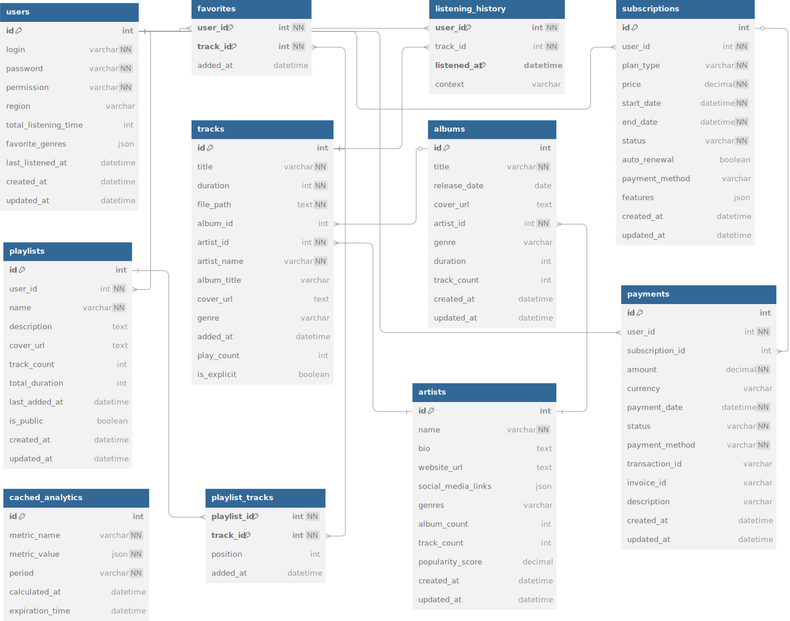

# VK музыка

## 1. Тема и целевая аудитория

VK музыка - российский стриминговый сервис компании VK, объединяющий музыкальную платформу «ВКонтакте» и отдельное приложение для прослушивания музыки.

### Функционал MVP

1. Аутентификация пользователей
2. Поиск и нахождение музыки
3. Прослушивание и воспроизведение музыки
4. Добавление треков в плейлист
5. Создание и редактирование плейлистов
6. История прослушиваний пользователя

### Целевая аудитория

#### Анализ трафика и вовлеченности
* MAU - **42млн** [^1]
* DAU - **5-10млн** [^1]
* Средняя продолжительность сессии - **00:02:17** [^2]
* Среднее количество страниц на посещение - **1,90** [^2]
* Среднее количество новых пользователей в месяц - **1 млн** [^2]

#### Веб-трафик по странам

[](https://www.similarweb.com/ru/website/music.vk.com) [^2]

#### Демографические показатели

Общая характеристика аудитории (гендер и возраст) [^2]

[](https://www.similarweb.com/ru/website/music.vk.com) 


## 2. Расчет нагрузки

### Продуктовые метрики

| Метрика                  | Значение         | Источник/Формула                              |
|--------------------------|------------------|-----------------------------------------------|
| **MAU**                  | 42M             | [Пресс-релиз VK](RUS_Press_Release_9M_2024.pdf) |
| **DAU**                  | 5-10M           | [Пресс-релиз VK](RUS_Press_Release_9M_2024.pdf) |
| **Хранилище:**           |                  |                                               |
| - Треки/пользователь             | 100              | Среднее количество треков в библиотеке пользователя по анализу аналоговых источников [Анализ аналогичного приложения. Пользователи Spotify создают в среднем 3-5 плейлистов, каждый из которых содержит 20-30 треков](https://newsroom.spotify.com/company-info/)                               |
| - Метаданные/пользователь        | 0.01 ГБ        | `100 треков × 0.1 МБ` [Расчет](#meta)                              |
| **Действия/день:**       |                  |                                               |
| - Поиск                  | 3-5             | [На основе анализа поведения пользователей Spotify, среднее количество поисковых действий оценивается в 3-5 раз в день](https://www.vox.com/2014/8/18/6003271/why-are-songs-3-minutes-long)                               |
| - Прослушивание          | 12 треков        | [Расчет](#audio-calc)                         |
| - Добавление в плейлист  | 1             | `1 добавление/12 прослушиваний`                      |

---

#### Метаданные трека {#meta}
| Компонент              | Размер на 1 трек | Размер на 100 треков |
|------------------------|------------------|----------------------|
| **ID трека**           | 16 B             | 1.6 КБ               |
| **Текстовые данные**   | 400 B            | 40 КБ                |
| **Обложка**            | 80 КБ            | 8 МБ                 |
| **Теги**               | 100 B            | 10 КБ                |
| **Дата добавления**    | 8 B              | 0.8 КБ               |
| **Дополнительные данные** | 19.5 КБ       | 1.95 МБ              |
| **Итого**              | **100 КБ (0.1 МБ)** | **10 МБ (0.01 ГБ)** |

#### Среднее количество прослушивания треков в день {#audio-calc}
1. `3-5 сессий × 2:17 мин = 6.8-11.4 мин/день`  
2. `(6.8 мин ÷ 4 мин/трек) + (11.4 ÷ 3) = 1.7(минимум)-3.8(максимум) треков`  
3. **С переключениями треков**: ` в среднем 12 треков/день, они включают повторные прослушивания и переключения между треками.`

## Технические метрики

### Хранилище
| Тип данных              | Единицы      | Объем (ТБ) | Формула расчета                     |
|-------------------------|--------------|------------|--------------------------------------|
| **Аудиофайлы**          | 50 млн треков| 250        | `5 МБ/трек × 50M`                   |
| **Метаданные треков**   | 50 млн запис.| 5          | `0.1 МБ/трек × 50M`                 |
| **Профили пользователей**| 42 млн аккаунтов | 4.2    | `100 КБ/пользователь × 42M`                 |

---

### Сетевые показатели

#### Пиковая нагрузка (Гбит/с)
| Тип трафика       | Значение | Формула                                |
|--------------------|----------|----------------------------------------|
| Аудиопотоки       | 128      | `1M потоков × 128 кбит/с`              |
| API-запросы       | 0.08       | `10k RPS × 1 КБ/запрос × 8 бит`        |

**Пояснения:**  
- **1M потоков**: 10% от DAU (10M) одновременно слушают музыку.  
- **128 кбит/с**: [Битрейт аудио для среднего качества ](https://support.spotify.com/md-ru/article/high-quality-streaming/).  
- **10k RPS**: Пиковые запросы к API (поиск, плейлисты, аутентификация).

#### Суточный трафик (ТБ/день)
| Тип трафика       | Значение | Формула                                |
|--------------------|----------|----------------------------------------|
| Аудио             | 440     | `10M DAU × 12 треков × 3.66 МБ`           |
| API               | 1        | `100M запросов × 10 КБ`                |

---

**Пояснения:**  
- **12 треков/день**: Из продуктовых метрик (прослушивание).  
- **4 МБ/трек**: Размер трека = 128 бит/с × 240 с = 30,720 бит  
Размер (МБ) = 30,720 / 8 / 1,048,576 ≈ 3.66 МБ  

### Производительность (RPS)

Средний RPS = Общее кол-во запросов в день / 86,400  
Пиковый RPS = Средний RPS × 2 (коэффициент пиковой нагрузки)

| Метод                     | Средний | Пиковый  | Формула расчета              |
|---------------------------|---------|----------|-------------------------------|
| **Поиск**                | 580     | 1,160    | `50M/86400 × 2`             |
| **Воспроизведение**      | 1,388   | 2,777   | `120M/86400 × 2`            |
| **Добавление в плейлист**| 116     | 232    | `10M/86400 × 2`             |
| **Аутентификация**       | 116     | 232    | `10M/86400 × 2`             |
| **Управление плейлистами**| 17    | 34      | `1.43M/86400 × 2`              |
| **Запись истории**       | 1,388  | 2,777   | `120M/86400 × 2`            |

---

**Пояснения:**  
- **Поиск (50M/день)**:  
  `10M DAU × 5 запросов/день` (аналогия с Spotify).  
- **Воспроизведение (120M/день)**:  
  `10M DAU × 12 треков/день` (из продуктовых метрик).  
- **Добавление в плейлист (10M/день)**:  
  `10M DAU × 1 добавление/день (1 сохранение на 12 прослушиваний).  
- **Аутентификация (10M/день)**:  
  Каждый DAU выполняет 1 вход в день.  
- **Управление плейлистами (6M/день)**:  
  `10M DAU / 7 дней` (пользователи редактируют плейлисты в среднем раз в неделю).  
- **Запись истории (120M/день)**:  
  Сохранение каждого прослушивания: `10M DAU × 12 треков`.  

**Примечания:**  
1. **Коэффициент ×2 для пика** — обоснован географическим распределением пользователей и разницей в часовых поясах. Сервис охватывает территорию СНГ, где пользователи находятся в разных часовых поясах (от UTC+2 до UTC+12). Пиковая нагрузка распределяется во времени: когда в одном регионе вечер (пик активности), в другом — утро или день (низкая активность). Таким образом, пиковая нагрузка в целом по системе не превышает [2-кратного значения](https://habr.com/en/companies/dcmiran/articles/496542/) от средней.

2. **86,400** — количество секунд в сутках (`24 × 60 × 60`).  

## 3. Глобальная балансировка нагрузки

### 1. Функциональное разбиение по доменам

Для VK Музыки функциональное разбиение сосредоточено на основном домене:

**Основной домен**: music.vk.com – лендинг и веб-интерфейс.

**API**: api.music.vk.com – аутентификация, поиск, плейлисты.

**Стриминг**: stream.music.vk.com – аудиопотоки.

**Статика**: cdn.music.vk.com – обложки, метаданные.

### 2. Обоснование расположения ДЦ (влияние на продуктовые метрики)

#### Основные регионы пользователей

На основе данных о трафике, основными регионами, где сосредоточена аудитория VK Музыки, являются:
- **Россия**: 48.47% трафика
- **Беларусь**: 15.09% трафика
- **Казахстан**: 14.18% трафика
- **Молдова**: 8.68% трафика

Эти четыре регион генерируют более 90% всего трафика сервиса. Это значит, что именно здесь сосредоточено большинство пользователей, и здесь нужно размещать ДЦ.


#### Расчет количества серверов

1. **Пиковая нагрузка**:  
   - **Аудиопотоки**: 128 Гбит/с.  
   - **API-запросы**: 10k RPS.  

2. **Мощность одного сервера**:  
   - Сервер средней мощности (8 vCPU, 32GB RAM) может выдавать примерно 300 Мбит/с.

3. **Общее количество серверов**:  
   - Пиковое потребление в сутки: 128 Гбит/с.  
   - Количество серверов:  
     - 1 Гбит = 1024 Мбит, поэтому 128 Гбит/с = 128 × 1024 = 131072 Мбит/с.  
     - Мощность одного сервера: 300 Мбит/с.  
     - Количество серверов = 131072 Мбит/с / 300 Мбит/с ≈ 437 серверов.  
     - С запасом х2: 437 × 2 = 874 сервера.

#### Распределение серверов по ДЦ

Распределим серверы по ДЦ в соответствии с количеством пользователей в каждом регионе:


| Регион       | Доля трафика | Количество серверов | Расположение ДЦ         |
|--------------|--------------|---------------------|-------------------------|
| **Россия**   | 48.47%       | 424                 | Москва, Санкт-Петербург, Екатеринбург, Новосибирск |
| **Беларусь** | 15.09%       | 132                 | Минск                   |
| **Казахстан**| 14.18%       | 124                 | Алматы                  |
| **Молдова**  | 11.8%        | 103                  | Кишинев                 |
| **Другие**   | 10.46%       | 91                  | Резервные ДЦ            |


---

#### Примечание 
  1. **Россия**:
      - **Москва и Санкт-Петербург**: Крупнейшие города с высокой концентрацией пользователей.
      - **Екатеринбург**: Ключевой город на Урале.
      - **Новосибирск**: Крупный город Сибири.
  2. **Беларусь**: **Минск** (15.09% трафика).
  3. **Казахстан**: **Алматы** (14.18% трафика).
  4. **Молдова**: **Кишинев** (11.8% трафика).

---
## 3. Глобальная балансировка нагрузки

### 1. Функциональное разбиение по доменам

Для VK Музыки функциональное разбиение сосредоточено на основном домене:

**Основной домен**: music.vk.com – лендинг и веб-интерфейс.

**API**: api.music.vk.com – аутентификация, поиск, плейлисты.

**Стриминг**: stream.music.vk.com – аудиопотоки.

**Статика**: cdn.music.vk.com – обложки, метаданные.

### 2. Обоснование расположения ДЦ (влияние на продуктовые метрики)

#### Основные регионы пользователей

На основе данных о трафике, основными регионами, где сосредоточена аудитория VK Музыки, являются:
- **Россия**: 48.47% трафика
- **Беларусь**: 15.09% трафика
- **Казахстан**: 14.18% трафика
- **Молдова**: 8.68% трафика

Эти четыре региона генерируют более 90% всего трафика сервиса. Это значит, что именно здесь сосредоточено большинство пользователей, и здесь нужно размещать ДЦ.

#### Расчет количества серверов

1. **Пиковая нагрузка**:  
   - **Аудиопотоки**: 128 Гбит/с.  
   - **API-запросы**: 10k RPS.  

2. **Мощность одного сервера**:  
   - Сервер средней мощности (8 vCPU, 32GB RAM) может выдавать примерно 300 Мбит/с.

3. **Общее количество серверов**:  
   - Пиковое потребление в сутки: 128 Гбит/с.  
   - Количество серверов:  
     - 1 Гбит = 1024 Мбит, поэтому 128 Гбит/с = 128 × 1024 = 131072 Мбит/с.  
     - Мощность одного сервера: 300 Мбит/с.  
     - Количество серверов = 131072 Мбит/с / 300 Мбит/с ≈ 437 серверов.  
     - С запасом х2: 437 × 2 = 874 сервера.

#### Распределение серверов по ДЦ

Распределим серверы по ДЦ в соответствии с количеством пользователей в каждом регионе. Резервные ДЦ включены в общее распределение:

| Регион       | Доля трафика | Количество серверов | Расположение ДЦ         | Тип ДЦ       |
|--------------|--------------|---------------------|-------------------------|--------------|
| **Россия**   | 48.47%       | 424                 | Москва, Екатеринбург, Новосибирск | Основной     |
| **Беларусь** | 15.09%       | 132                 | Минск                   | Основной     |
| **Казахстан**| 14.18%       | 124                 | Алматы                  | Основной     |
| **Молдова**  | 8.68%        | 76                  | Кишинев                 | Основной     |
| **Резервные ДЦ** | 13.58%    | 118                 | Москва, Екатеринбург, Новосибирск, Минск, Алматы, Кишинев | Резервный    |

---

#### Примечание 
1. **Россия**:
   - **Москва**: Центральный регион с наибольшей концентрацией пользователей.
   - **Екатеринбург**: Ключевой город на Урале.
   - **Новосибирск**: Крупный город Сибири.
2. **Беларусь**: **Минск** (15.09% трафика).
3. **Казахстан**: **Алматы** (14.18% трафика).
4. **Молдова**: **Кишинев** (8.68% трафика).
5. **Резервные ДЦ**: Расположены в тех же регионах, что и основные ДЦ, для обеспечения отказоустойчивости.

---

### 3. Распределение запросов по типам и ДЦ

На основе данных из раздела "Расчет нагрузки":

#### Распределение запросов по типам

| Тип запроса           | Количество запросов/день | Распределение по ДЦ  |
|------------------------|--------------------------|------------------------------|
| **Поиск**             | 50M                     | 48.47% — Россия, 15.09% — Беларусь, 14.18% — Казахстан, 8.68% — Молдова, 13.58% — Резервные ДЦ |
| **Воспроизведение**   | 120M                    | 48.47% — Россия, 15.09% — Беларусь, 14.18% — Казахстан, 8.68% — Молдова, 13.58% — Резервные ДЦ |
| **Добавление в плейлист** | 10M                  | 48.47% — Россия, 15.09% — Беларусь, 14.18% — Казахстан, 8.68% — Молдова, 13.58% — Резервные ДЦ|
| **Аутентификация**    | 10M                     | 48.47% — Россия, 15.09% — Беларусь, 14.18% — Казахстан, 8.68% — Молдова, 13.58% — Резервные ДЦ |
| **Управление плейлистами** | 6M               | 48.47% — Россия, 15.09% — Беларусь, 14.18% — Казахстан, 8.68% — Молдова, 13.58% — Резервные ДЦ |
| **Запись истории**    | 120M                    | 48.47% — Россия, 15.09% — Беларусь, 14.18% — Казахстан, 8.68% — Молдова, 13.58% — Резервные ДЦ |

---

#### Распределение запросов по ДЦ

| Регион       | Доля трафика | Распределение запросов | Расположение ДЦ         | Тип ДЦ       |
|--------------|--------------|------------------------|-------------------------|--------------|
| **Россия**   | 48.47%       | 48.47%                 | Москва, Екатеринбург, Новосибирск | Основной     |
| **Беларусь** | 15.09%       | 15.09%                 | Минск                   | Основной     |
| **Казахстан**| 14.18%       | 14.18%                 | Алматы                  | Основной     |
| **Молдова**  | 8.68%        | 8.68%                  | Кишинев                 | Основной     |
| **Резервные ДЦ** | 13.58%    | 13.58%                 | Москва, Екатеринбург, Новосибирск, Минск, Алматы, Кишинев | Резервный    |

---

#### Расчёты для каждого ДЦ

| Тип запроса           | Москва (30%) | Екатеринбург (10%) | Новосибирск (8.47%) | Минск (15.09%) | Алматы (14.18%) | Кишинев (8.68%) | Резервные ДЦ (13.58%) |
|------------------------|--------------|--------------------|---------------------|----------------|-----------------|-----------------|-----------------------|
| **Поиск**             | 15M/день     | 5M/день            | 4.235M/день         | 7.545M/день    | 7.09M/день      | 4.34M/день      | 6.79M/день            |
| **Воспроизведение**   | 36M/день     | 12M/день           | 10.164M/день        | 18.108M/день   | 17.016M/день    | 10.416M/день    | 16.296M/день          |
| **Добавление в плейлист** | 3M/день  | 1M/день            | 0.847M/день         | 1.509M/день    | 1.418M/день     | 0.868M/день     | 1.358M/день           |
| **Аутентификация**    | 3M/день      | 1M/день            | 0.847M/день         | 1.509M/день    | 1.418M/день     | 0.868M/день     | 1.358M/день           |
| **Управление плейлистами** | 1.8M/день | 0.6M/день          | 0.508M/день         | 0.905M/день    | 0.851M/день     | 0.521M/день     | 0.815M/день           |
| **Запись истории**    | 36M/день     | 12M/день           | 10.164M/день        | 18.108M/день   | 17.016M/день    | 10.416M/день    | 16.296M/день          |

### 4. Схема DNS балансировки

Каждый ДЦ равномерно обрабатывает все типы запросов. В случае отказа одного ДЦ, запросы перенаправляются на резервные ДЦ. Логичным будет использование схемы балансировки Geo-based DNS, которая использует географическое распределение для минимизации задержек и обеспечивает отказоустойчивость за счёт резервных ДЦ.

1. **Москва (ДЦ 1)** → Резерв: Екатеринбург (ДЦ 2) → Резерв: Новосибирск (ДЦ 3)
2. **Екатеринбург (ДЦ 2)** → Резерв: Москва (ДЦ 1) → Резерв: Новосибирск (ДЦ 3)
3. **Новосибирск (ДЦ 3)** → Резерв: Москва (ДЦ 1) → Резерв: Екатеринбург (ДЦ 2)
4. **Минск (ДЦ 4)** → Резерв: Кишинев (ДЦ 6) → Резерв: Резервные ДЦ
5. **Алматы (ДЦ 5)** → Резерв: Новосибирск (ДЦ 3) → Резерв: Екатеринбург (ДЦ 2)
6. **Кишинев (ДЦ 6)** → Резерв: Минск (ДЦ 4) → Резерв: Резервные ДЦ

Каждый ДЦ имеет два уровня резервов. Если основной ДЦ падает, запросы перекидываются на первый резерв. Если и резерв падает, то на второй.

### 5. Схема Anycast балансировки
Для глобального стриминга лучше использовать BGP Anycast. DNS-балансировки недостаточно. Anycast через BGP мгновенно переключает трафик при падении ДЦ, а DNS зависит от TTL кешей. Anycast автоматически направляет запросы к ближайшему ДЦ на уровне сетевой маршрутизации, уменьшая задержки. 

### 6. Механизм регулировки трафика между ДЦ

Для VK Музыки используется гибридный подход, сочетающий DNS и Anycast балансировку. 

1. **Географическая балансировка (GeoDNS)**:  
   - Пользователи подключаются к ближайшему ДЦ на основе их IP-адреса.  

2. **Резервирование при сбоях**:  
   - Если ДЦ падает, DNS и Anycast перенаправляют трафик на резервы.

| Тип трафика              | Метод регулировки       | 
|--------------------------|-------------------------|
| **Аудиопотоки**          | Anycast + резервы       | 
| **Аутентификация**       | GeoDNS                  | 
| **Поиск**                | GeoDNS                  | 
| **Управление плейлистами** | GeoDNS  |
| **Добавление в плейлист** | GeoDNS                 | 
| **Запись истории**       | GeoDNS                  |
---

| Тип домена              | Метод регулировки       | 
|--------------------------|-------------------------|
| **Основной домен**          |   GeoDNS     | 
| **API**       | GeoDNS                  | 
| **Стриминг**                | Anycast + резервы                   | 
| **Статика** | GeoDNS  |

## 4. Локальная балансировка нагрузки

Для музыкального приложения VK Музыка локальная балансировка будет организована следующим образом:

### 1. Схемы балансировки

### Аудиопотоки (stream.music.vk.com)
- Балансировка: на уровне L4 (TCP/UDP) с использованием  NGINX.
- Алгоритм балансировки: Least Connections для равномерного распределения нагрузки, чтобы обеспечить стабильную и высококачественную работу сервиса.

### API-запросы (api.music.vk.com)
- Балансировка: на уровне L7 (HTTP/HTTPS) с использованием NGINX.
- Алгоритм балансировки: Round Robin с учетом весов серверов, чтобы эффективно использовать ресурсы и улучшить общее время отклика.

### Межсервисное взаимодействие
- Балансировка: использование Sidecar proxy для балансировки между микросервисами.
- Интеграция: с Service discovery (Kubernetes).

### Статика (cdn.music.vk.com)
- Балансировка: на уровне L7 (HTTP/HTTPS) с использованием NGINX.
- Кэширование: статики на балансировщике для снижения нагрузки на backend.

### 2. Схема отказоустойчивости

Для обеспечения отказоустойчивости внутри каждого ДЦ необходимо:

### Резервирование серверов:
Каждый сервис должен иметь как минимум два экземпляра.
В случае сбоя одного сервера, балансировщик автоматически перенаправляет запросы на резервные серверы.
### Health checks:
Балансировщики (NGINX) должны регулярно проверять доступность серверов.

### Автоматическое восстановление:
Использование Kubernetes для автоматического перезапуска упавших сервисов.

### 3. Расчет нагрузки по терминации SSL
Терминация SSL на балансировщике снижает нагрузку на серверы, но требует значительных ресурсов на самом балансировщике. Рассчитаем нагрузку для API-запросов:

RPS: 10,000.
Размер ключа SSL: 2048 бит
Ресурсы на одно соединение: ~1 ms CPU на одно SSL-рукопожатие.
Общая нагрузка:
Для 10,000 RPS потребуется примерно 10 секунд CPU времени на обработку SSL-рукопожатий.
С учетом параллельной обработки, потребуется несколько ядер CPU для терминации SSL.


Таким образом, локальная балансировка нагрузки должна быть организована с учетом специфики каждого типа запросов:
- L4 для аудиопотоков (низкая задержка, высокая пропускная способность).
- L7 для API и статики (глубокая маршрутизация, терминация SSL).
- Sidecar proxy для межсервисного взаимодействия (отказоустойчивость, автоматическое обнаружение сервисов).

## 5. Логическая схема БД

https://dbdiagram.io/d/67e046ac75d75cc844253ffd


### Описание таблиц базы данных VK Музыка

### Таблицы БД и их описание

| Название таблицы | Назначение                          | Основные поля                                                                 | Связи                                                                 |
|------------------|-------------------------------------|-------------------------------------------------------------------------------|-----------------------------------------------------------------------|
| **users**        | Хранение данных пользователей       | `id` (PK), `login`, `password`, `permission`, `region`, `created_at`, `updated_at` | Один ко многим с `playlists`, `listening_history`, `favorites`, `subscriptions`, `payments` |
| **artists**      | Хранение данных артистов            | `id` (PK), `name`, `bio`, `website_url`, `social_media_links`, `created_at`, `updated_at` | Один ко многим с `albums`, `tracks`                                         |
| **playlists**    | Хранение плейлистов пользователей   | `id` (PK), `user_id` (FK), `name`, `description`, `cover_url`, `created_at`, `updated_at` | Один ко многим с `playlist_tracks`, `users`    |
| **playlist_tracks** | Связь плейлистов и треков        | `playlist_id` (FK), `track_id` (FK), `added_at`                              | Многие ко многим между `playlists` и `tracks`                              |
| **listening_history** | История прослушивания треков   | `id` (PK), `user_id` (FK), `track_id` (FK), `listened_at`                    | Один ко многим с `users` и `tracks`                                       |
| **albums**       | Хранение данных альбомов            | `id` (PK), `title`, `release_date`, `cover_url`, `artist_id` (FK), `created_at`, `updated_at` | Один ко многим с `tracks`, `artists`        |
| **tracks**       | Хранение данных треков              | `id` (PK), `title`, `duration`, `file_path`, `album_id` (FK), `artist_id` (FK), `cover_url`, `added_at` | Один ко многим с `playlist_tracks`, `listening_history`, `track_genres`, `albums` и `artists`|
| **track_genres** | Связь треков и жанров               | `track_id` (FK), `genre_id` (FK)                                             | Многие ко многим между `tracks` и `genres`                                |
| **genres**       | Хранение данных жанров              | `id` (PK), `name`                                                            | Один ко многим с `track_genres`                                           |
| **favorites**    | Хранение избранных треков пользователей | `user_id` (FK), `track_id` (FK), `added_at`                                | Многие ко многим между `users` и `tracks`                                 |
| **search_queries** | Хранение истории поисковых запросов | `id` (PK), `user_id` (FK), `query`, `created_at`                            | Один ко многим с `users`                                                  |
| **recommendations** | Хранение рекомендаций треков      | `id` (PK), `user_id` (FK), `track_id` (FK), `score`, `created_at`           | Один ко многим с `users` и `tracks`                                       |
| **subscriptions** | Хранение данных о подписках пользователей | `id` (PK), `user_id` (FK), `plan`, `start_date`, `end_date`, `status`, `created_at`, `updated_at` | Один ко многим с `users`                                                  |
| **payments**     | Хранение данных о платежах          | `id` (PK), `user_id` (FK), `amount`, `payment_date`, `status`, `payment_method`, `transaction_id`, `created_at`, `updated_at` | Один ко многим с `users`                                                  |

### Расчет размеров данных 

| Название таблицы | Расчет размера строки (поля) | Размер строки | Всего строк | Размер таблицы |
|------------------|------------------------------|---------------|-------------|----------------|
| **users**        | 16 (id) + 50 (login) + 50 (email) + 100 (password_hash) + 4 (permission) + 4 (created_at) + 4 (updated_at) | 228 байт      | 42 млн      | ~9.1 ГБ        |
| **artists**      | 16 (id) + 100 (name) + 500 (bio) + 100 (website_url) + 500 (social_media_links) + 4 (created_at) + 4 (updated_at) | 1,224 байт    | 1 млн       | ~1.17 ГБ       |
| **playlists**    | 16 (id) + 16 (user_id) + 100 (name) + 500 (description) + 100 (cover_url) + 4 (created_at) + 4 (updated_at) | 740 байт      | 126 млн     | ~87.1 ГБ       |
| **playlist_tracks** | 16 (playlist_id) + 16 (track_id) + 4 (added_at) | 36 байт       | 1,26 млрд     | ~ 45.36 ГБ      |
| **listening_history** | 16 (id) + 16 (user_id) + 16 (track_id) + 4 (listened_at) | 52 байт       | 8.4 млрд    | ~ 436.8 Гб        |
| **albums**       | 16 (id) + 100 (title) + 4 (release_date) + 100 (cover_url) + 16 (artist_id) + 4 (created_at) + 4 (updated_at) | 244 байт      | 10 млн      | ~2.3 ГБ        |
| **tracks**       | 16 (id) + 100 (title) + 4 (duration) + 100 (file_path) + 16 (album_id) + 16 (artist_id) + 100 (cover_url) + 4 (added_at) | 356 байт      | 50 млн      | ~16.6 ГБ       |
| **track_genres** | 16 (track_id) + 16 (genre_id) | 32 байт       | 100 млн     | ~3.05 ГБ       |
| **genres**       | 16 (id) + 50 (name)           | 66 байт       | 1,000       | ~64.5 КБ       |
| **favorites**    | 16 (user_id) + 16 (track_id) + 4 (added_at) | 36 байт       | 500 млн      | ~16.8 ГБ (10 треков в среднем в избранном у пользователя по данным SimilarWeb)      |
| **search_queries** | 16 (id) + 16 (user_id) + 100 (query) + 4 (created_at) | 136 байт      | 50 млн      | ~6.35 ГБ       |
| **recommendations** | 16 (user_id) + 16 (track_id) + 4 (score) + 4 (created_at) | 40 байт       | 50 млн      | ~1.86 ГБ       |
| **subscriptions** | 16 (id) + 16 (user_id) + 50 (plan) + 4 (start_date) + 4 (end_date) + 4 (status) + 4 (created_at) + 4 (updated_at) | 102 байт      | 42 млн      | ~4.1 ГБ        |
| **payments**     | 16 (id) + 16 (user_id) + 8 (amount) + 4 (payment_date) + 4 (status) + 50 (payment_method) + 100 (transaction_id) + 4 (created_at) + 4 (updated_at) | 206 байт      | 42 млн      | ~8.2 ГБ        |

#### Примечание

##### 1. **Таблица `recommendations`**
- **Создание**:  
  Таблица инициализируется при запуске системы.
- **Генерация рекомендаций**:
  - **Источники данных**:  
    Используются таблицы:
    - `listening_history` (история прослушиваний),
    - `favorites` (понравившиеся треки),
    - `playlist_tracks` (треки из плейлистов).
  - **Процесс**:  
    1. Формируется "профиль интересов" пользователя.  
    2. ML-модель вычисляет `score` для непрослушанных треков.  
    3. Топ-5 треков в день с `score > 0.8` записываются в таблицу.
- **Обновление и очистка**:  
  - Ежедневно удаляются устаревшие рекомендации.  
  - Добавляется **50 млн новых записей/день** (DAU × рекомендации на пользователя).  

---
##### 2. **Таблица `listening_history*`**
- Реализован механизм FIFO (First In - First Out):
   - При добавлении нового трека удаляется самый старый, если достигнут лимит в 200 треков [Официальный пост VK](https://vk.com/wall-2158488_630793)
- **Расчет объема**:  
  - Общее количество записей:  
    ```math
    42\ \text{млн пользователей} \times 200\ \text{треков} = 8.4\ \text{млрд записей}.
    ```  
  - Объем данных:  
    ```math
      8.4\ \text{млрд} \times 52\ \text{байта} = 436.8\ \text{ГБ}.
    ```  
---
##### 3. **Таблица `playlist_tracks`**
- **Расчет объема**:  
  - Среднее значение: **10 треков/плейлист**.  
  - Общее количество записей:  
    ```math
    126\ \text{млн плейлистов} \times 10\ \text{треков} = 1.26\ \text{млрд записей}.
    ```  
  - Объем данных:  
    ```math
    1.26\ \text{млрд} \times 36\ \text{байт} = 45.36\ \text{ГБ}.
    ```  


### Таблица нагрузки (QPS) по таблицам

Считалось, отталкиваясь от RPS на основные части системы.

| Таблица              | Тип нагрузки | Расчет                                                                                                           | Итого QPS |
| --------------------------- | ----------------------- | ---------------------------------------------------------------------------------------------------------------------- | -------------- |
| **users**             | Чтение            | Аутентификация (116 RPS)                                                                                 | 116            |
| **tracks**            | Чтение            | Поиск (580 RPS) + Воспроизведение (1,388 RPS) + Добавление в плейлист (116 RPS) | ~2,084         |
|                             | Запись            | Редкие операции (добавление треков)                                                      | ~5             |
| **artists**           | Чтение            | Поиск (30% от 580) + Воспроизведение (50% от 1,388)                                            | ~874           |
| **albums**            | Чтение            | Аналогично `artists`                                                                                       | ~874           |
| **playlists**         | Чтение            | Добавление в плейлист (116) + Управление (17)                                             | 133            |
| **playlist_tracks**   | Чтение            | Проверка при добавлении (116)                                                                     | 116            |
|                             | Запись            | Добавление в плейлист (116)                                                                         | 116            |
| **listening_history** | Запись            | Воспроизведение (1,388)                                                                                 | 1,388          |
| **genres**            | Чтение            | Поиск по жанрам (20% от 580)                                                                            | ~116           |
| **track_genres**      | Чтение            | Поиск по жанрам (20% от 580)                                                                            | ~116           |
| **favorites**         | Чтение            | Предполагаемая активность                                                                      | ~200           |
| **search_queries**    | Запись            | Логирование поиска (580)                                                                              | 580            |
| **recommendations**   | Чтение            | Показ рекомендаций                                                                                    | ~300           |
| **subscriptions**     | Чтение            | Проверка подписки при воспроизведении (10% от 1,388)                               | ~139           |

### Требования к консистентности

1. **Уникальность ключей**:
   - Все первичные и внешние ключи должны быть уникальными .

2. **Проверка целостности**:
   - Внешние ключи должны ссылаться на существующие записи.
  

### Особенности распределения нагрузки по ключам


1. **Репликация для чтения**:
   - Таблицы с высокой нагрузкой на чтение (`tracks`, `playlists`, `listening_history`) реплицируются на несколько узлов.

2. **Кэширование популярных данных**:
   - Популярные треки, плейлисты и рекомендации кэшируются.


## 6. Физическая схема БД



#### Денормализация данных:
1. **Дублирование ключевых полей**:
   - `artist_name` и `album_title` в таблице `tracks` - уменьшение JOIN-операций при частых запросах,
   - Жанры теперь хранятся как строки в таблицах `artists`, `albums` и `tracks`.

2. **Оптимизированная история прослушиваний**:
   - Упрощенная структура `listening_history` без дублирования данных,
   - Составные индексы для быстрого доступа к истории по пользователю и дате.

3. **Избранное**:
   - Минималистичная структура `favorites` (только user_id + track_id),
   - Индексы для быстрого поиска по пользователю и треку.

#### Агрегация данных и счетчики:
- `track_count`/`album_count` для артистов,  
- `total_duration` в плейлистах,  
- `total_listening_time` у пользователей - мгновенный доступ к статистике без вычислений.

#### Аналитика и мониторинг:
- Новая таблица `cached_analytics`- Предрасчет ключевых метрик для быстрой аналитики с целью:
   - Ускорения формирования отчетов
   - Снижения нагрузки на оперативные БД
   - Обеспечения мгновенного доступа к агрегированным данным
      | Поле             | Тип данных       | Описание                                                                 |
      |------------------|------------------|--------------------------------------------------------------------------|
      | `id`             | SERIAL           | Первичный ключ (автоинкремент)                                          |
      | `metric_name`    | VARCHAR(50)      | Название метрики (top_tracks, user_activity и т.д.)                     |
      | `metric_value`   | JSONB            | Значения метрик в JSON-формате                                          |
      | `period`         | VARCHAR(10)      | Период агрегации: daily/weekly/monthly                                  |
      | `calculated_at`  | TIMESTAMPTZ      | Время последнего расчета метрики                                        |
      | `expiration_time`| TIMESTAMPTZ      | Время автоматической инвалидации записи                                 |
      | `region`         | VARCHAR(20)      | Региональная привязка данных (необязательно)                              |

- Поле `context` в `listening_history`- анализ источников прослушивания (плейлист, поиск, рекомендации),
- `popularity_score` у артистов - для персонализации рекомендаций.

####  Управление подписками и платежами
   - Поле `features` в формате JSON для хранения особенностей тарифа,
   - Индексы для управления автоматическим продлением,
   - Подробная таблица `payments` с историей статусов.

#### Управление контентом:
- `is_explicit` - фильтрация контента  
- `is_public` - настройки приватности плейлистов  

#### Обеспечение целостности:
- Автоматические `created_at`/`updated_at`.
- Каскадные обновления/ удаления для связанных данных.
- Индексы для аналитических запросов
     - `play_count` в треках
     - `release_date` в альбомах
     - `last_listened_at` у пользователей
     - `payment_date` в платежах

####  Первичные ключи

| Таблица              | Название ПК | Поля ПК       |
|----------------------|---------------------------|-----------------------------|
| users                | pk_users                  | id                          |
| artists              | pk_artists                | id                          |
| albums               | pk_albums                 | id                          |
| tracks               | pk_tracks                 | id                          |
| playlists            | pk_playlists              | id                          |
| playlist_tracks      | pk_playlist_tracks        | (playlist_id, track_id)     |
| listening_history    | pk_listening_history      | (user_id, listened_at)      |
| favorites           | pk_favorites             | (user_id, track_id)         |
| cached_analytics     | pk_cached_analytics       | id                          |
| subscriptions        | pk_subscriptions          | id                          |
| payments             | pk_payments               | id                          |

#### Вторичные индексы

| Таблица              | Название индекса                          | Поля индекса                          | Назначение |
|----------------------|------------------------------------------|---------------------------------------|------------|
| users                | idx_users_login                          | login                                 | Уникальный поиск по логину |
| users                | idx_users_permission_region              | (permission, region)                 | Фильтрация по правам и региону |
| users                | idx_users_last_listened                  | last_listened_at                     | Поиск по последней активности |
| artists              | idx_artists_name                         | name                                  | Поиск по имени исполнителя |
| artists              | idx_artists_popularity                   | popularity_score                     | Сортировка по популярности |
| artists              | idx_artists_genres                       | genres                                | Фильтрация по жанрам |
| artists              | idx_artists_updated                      | updated_at                           | Поиск по дате обновления |
| albums               | idx_albums_title                         | title                                 | Поиск по названию альбома |
| albums               | idx_albums_artist                        | artist_id                            | Фильтрация по исполнителю |
| albums               | idx_albums_artist_release                | (artist_id, release_date)            | Сортировка по дате выхода |
| albums               | idx_albums_genre                         | genre                                 | Фильтрация по жанру |
| albums               | idx_albums_release_date                  | release_date                         | Сортировка по дате релиза |
| tracks               | idx_tracks_title                         | title                                 | Поиск по названию трека |
| tracks               | idx_tracks_artist                        | artist_id                            | Фильтрация по исполнителю |
| tracks               | idx_tracks_album                         | album_id                             | Фильтрация по альбому |
| tracks               | idx_tracks_artist_plays                  | (artist_id, play_count)              | Популярные треки артиста |
| tracks               | idx_tracks_duration                      | duration                              | Фильтрация по длительности |
| tracks               | idx_tracks_genre                         | genre                                 | Фильтрация по жанру |
| tracks               | idx_tracks_search                        | (title, artist_name)                 | Комплексный поиск |
| tracks               | idx_tracks_play_count                    | play_count                           | Сортировка по популярности |
| playlists            | idx_playlists_user                       | user_id                              | Плейлисты пользователя |
| playlists            | idx_playlists_user_public                | (user_id, is_public)                | Фильтрация приватных |
| playlists            | idx_playlists_search                     | (name, description)                 | Поиск по названию |
| playlists            | idx_playlists_last_added                 | last_added_at                        | Сортировка по дате |
| playlist_tracks      | idx_playlist_tracks_order                | (playlist_id, position)              | Порядок треков |
| playlist_tracks      | idx_playlist_tracks_track                | track_id                             | Поиск по трекам |
| playlist_tracks      | idx_playlist_tracks_added                | added_at                             | Сортировка по дате |
| listening_history    | idx_history_track                        | track_id                             | Анализ популярности |
| listening_history    | idx_history_context                      | context                              | Анализ источников |
| listening_history    | idx_history_user_track                   | (user_id, track_id)                  | История по треку |
| favorites            | idx_favorites_user_time                  | (user_id, added_at)                  | Сортировка избранного |
| favorites            | idx_favorites_track                      | track_id                             | Поиск по трекам |
| cached_analytics     | idx_cached_analytics_name_period         | (metric_name, period)                | Уникальные метрики |
| cached_analytics     | idx_cached_analytics_expiration          | expiration_time                      | Очистка кеша |
| cached_analytics     | idx_cached_analytics_calculated          | calculated_at                        | Сортировка расчетов |
| subscriptions        | idx_subscriptions_user                   | user_id                              | Подписки пользователя |
| subscriptions        | idx_subscriptions_status_date            | (status, end_date)                   | Активные подписки |
| subscriptions        | idx_subscriptions_plan_type              | plan_type                            | Фильтрация по типу |
| subscriptions        | idx_subscriptions_renewal                | (auto_renewal, end_date)             | Автопродление |
| payments             | idx_payments_user                        | user_id                              | Платежи пользователя |
| payments             | idx_payments_subscription                | subscription_id                      | Платежи по подписке |
| payments             | idx_payments_status_date                 | (status, payment_date)               | Анализ платежей |
| payments             | idx_payments_transaction                 | transaction_id                       | Уникальные транзакции |
| payments             | idx_payments_invoice                     | invoice_id                           | Уникальные инвойсы |
| payments             | idx_payments_date                        | payment_date                         | Сортировка по дате |


#### Шардирование

- Таблица listening_history шардируется по двум ключам: user_id + временной диапазон (например, по месяцам).

  1. Для старых данных:
   - Активные данные (<3 мес.). Хранятся в Cassandra с TTL (TTL-индекс (expiration_time), автоматически удаляющий старые записи).
   - Холодные данные (3 - 24 мес.), хранятся в ClickHouse.
  2. Для новых пользователей:
   - Возвращаем пустую историю.

#### Выбор базы данных

Для VK Музыка предлагается использовать комбинацию из нескольких СУБД, оптимально подходящих для разных типов данных и нагрузок:

#### PostgreSQL - основная реляционная БД для хранения структурированных данных.
**Обоснование выбора**:
- Полная поддержка платежных транзакций,
- Широкие возможности индексирования,
- Репликация и шардирование.

**Для каких таблиц**:
- `users`, `artists`, `albums`, `playlists`, `subscriptions`, `payments`

#### Cassandra - хранение истории прослушиваний и аналитических данных.
**Обоснование выбора**:
- Линейная масштабируемость для записи,
- Эффективное хранение временных рядов (прослушивания по времени).
- Поддержка TTL для автоматического удаления старых данных.

**Для каких таблиц**:
- `listening_history` (первичное хранение)
- `cached_analytics` (промежуточные результаты)

#### ClickHouse - аналитика и отчетность.
**Обоснование выбора**:
- Высокая скорость агрегации (анализ популярности треков),
- Эффективное сжатие данных (экономия на хранении истории),
- Поддержка временных рядов (анализ активности по часам/дням).

**Для каких данных**:
- Агрегированная статистика прослушиваний,
- Ежедневные/еженедельные отчеты,
- Персонализированные рекомендации.

####  Redis - кэширование и быстрый доступ.  
**Обоснование выбора**:
- Кэш популярных треков и плейлистов,
- Сессии пользователей,
- Счетчики проигрываний.

**Для каких данных**:
- Сессионные данные,
- Рейтинги и чарты.


## Сводная таблица репликации

| Компонент            | Таблицы                     | Тип репликации          | Реплики на ДЦ | Расположение ДЦ                   | Особенности                          |
|----------------------|-----------------------------|-------------------------|---------------|------------------------------------|---------------------------------------|
| **Пользователи**     | `users`                     | Синхронная + асинхронная| 3 (2R/1W)     | Москва, СПб, Екатеринбург          | Чтение из локальных реплик            |
| **Платежи**         | `payments`, `transactions`  | Синхронная с арбитром   | 4 (2R/2W)     | Москва(основной), СПб  | Подтверждение операций    |
| **Сессии**          | `user_sessions`             | Асинхронная             | 2             | Все ДЦ                             | Цепочная репликация       |
| **История прослушиваний** | `listening_history` | Асинхронная             | 3             | Москва, СПб, Новосибирск           | Шардирование по времени + TTL 3 мес.  |
| **Метаданные**      | `tracks`, `albums`, `artists`| Синхронная             | 3             | Все ДЦ (3 реплики на каждый ДЦ)                            | Горячие реплики с кэшированием        |
| **Плейлисты**       | `playlists`, `playlist_tracks` | Синхронная         | 3             | Москва, Минск, Алматы              | Локальные реплики для низкой задержки |

## 7. Распределенные алгоритмы 

###  Сводная таблица распределенных алгоритмов

| Алгоритм/Механизм               | Область применения                                      | Мотивация                                                                 |
|----------------------------------|---------------------------------------------------------|---------------------------------------------------------------------------|
| **GeoDNS**                       | Глобальная балансировка запросов между ДЦ               | Минимизация задержки за счет направления пользователей к ближайшему ДЦ    |
| **BGP Anycast**                  | Маршрутизация аудиопотоков (стриминг)                   | Автоматическое переключение при сбоях ДЦ|
| **Round Robin (L7)**             | Балансировка API-запросов внутри ДЦ                     | Равномерное распределение нагрузки между серверами                       |
| **Least Connections (L4)**       | Балансировка аудиопотоков внутри ДЦ                     | Оптимизация использования ресурсов для длительных соединений             |
| **Шардирование по user_id**      | Распределение данных пользователей (плейлисты, избранное)| Горизонтальное масштабирование, локализация данных пользователей       |
| **Синхронная репликация**        | Платежные транзакции и метаданные                       | Гарантия консистентности критически важных данных                        |
| **Асинхронная репликация**       | История прослушиваний, аналитика                       | Высокая производительность записи при задержке синхронизации  |
| **TTL-based инвалидация**        | Управление историей прослушиваний (Cassandra)           | Автоматическое удаление устаревших данных   |                     |
| **Gossip-протокол**              | Обмен метриками между узлами (Cassandra/ClickHouse)     | Распределенный мониторинг состояния кластера                             |
| **Consistent Hashing**           | Распределение кэша (Redis)                              | Минимизация перераспределения данных при изменении топологии кластера    |
---

## Алгоритмы рекомендательной системы

| Алгоритм                     | Тип рекомендаций             | Данные для анализа                     | Как дополняет другие алгоритмы          |
|------------------------------|-----------------------------|----------------------------------------|-----------------------------------------|
| **Коллаборативная фильтрация (Item-based)** | Похожие треки на основе поведения пользователей | История прослушиваний, добавления в плейлисты | Базовая рекомендация, выявляет глобальные паттерны |
| **Контентная фильтрация**    | Похожие треки по метаданным | Жанры, текст песен  | Решает проблему "холодного старта" для новых треков |
| **Matrix Factorization (SVD)** | Персонализированные рекомендации | Скрытые взаимосвязи между пользователями и треками | Учитывает сложные неочевидные зависимости |


## 8. Технологии.


### Таблица технологий для VK Музыка

| Технология    | Область применения                                          | Мотивационная часть                                                                                                          |
| ----------------------- | ---------------------------------------------------------------------------- | ---------------------------------------------------------------------------------------------------------------------------------------------- |
| **Go**            | Backend (микросервисы)                                           | Высокая производительность, асинхронность, поддержка высоких нагрузок |
| **TypeScript**    | Frontend (веб/мобильное)                                         | Статическая типизация для надежности, интеграция с React/Next.js                                   |
| **React/Next.js** | Frontend                                                                     | динамические интерфейсы плеера                                                                     |
| **PostgreSQL**    | Основные данные (пользователи, плейлисты) | ACID-транзакции, поддержка шардинга                                |
| **Cassandra**     | История прослушиваний                                    | Линейная масштабируемость, TTL для автоматического удаления старых записей      |
| **ElasticSearch** | Поиск треков/артистов                                     | Полнотекстовый поиск с морфологией, ранжирование по популярности                      |
| **Redis**         | Кэш/сессии/очереди                                           | In-memory хранение горячих данных (часто слушаемые треки, топ-чарты)                           |
| **Nginx**         | L7 балансировка/SSL                                              | Терминация SSL, маршрутизация API-запросов, кэширование статики                               |
| **HAProxy**       | L4 балансировка потоков                                   | Распределение аудиопотоков                                  |
| **Kubernetes**    | Оркестрация                                                       | Автомасштабирование под нагрузкой                                              |
| **Prometheus**    | Мониторинг                                                         | Сбор метрик с нод/сервисов, интеграция с Grafana                                                              |
| **Grafana**       | Логирование                                                       | Централизованное хранение логов с фильтрацией по меткам (user_id, trace_id)                   |
| **ClickHouse**    | Аналитика/рекомендации                                  | Реалтайм-аналитика, ML-модели на SQL                                             |
| **Kafka**         | Стриминг событий                                              | Обработка событий/сек (прослушивания)                                                          |


## Список источников

https://corp.vkcdn.ru/media/files/RUS_Press_Release_9M_2024.pdf

https://www.similarweb.com/ru/website/music.vk.com

https://support.spotify.com/md-ru/article/high-quality-streaming/

https://habr.com/en/companies/dcmiran/articles/496542/

https://newsroom.spotify.com/company-info/

https://www.vox.com/2014/8/18/6003271/why-are-songs-3-minutes-long

https://vk.com/wall-2158488_630793