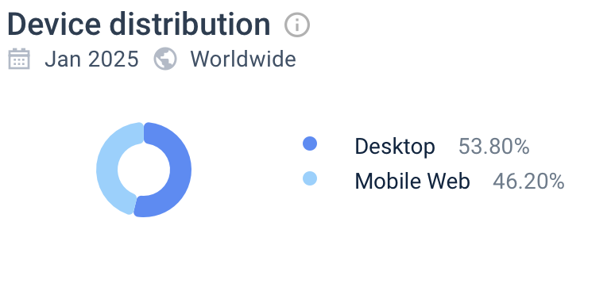
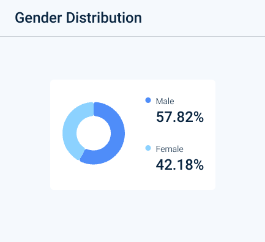
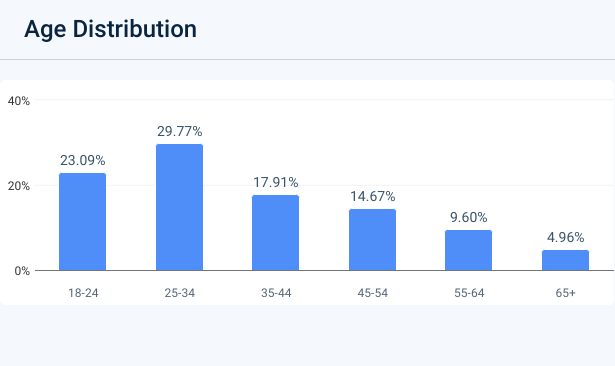

# VK музыка

## 1. Тема и целевая аудитория

VK музыка - российский стриминговый сервис компании VK, объединяющий музыкальную платформу «ВКонтакте» и отдельное приложение для прослушивания музыки.

### Функционал MVP

1. Аутентификация пользователей
2. Поиск и нахождение музыки
3. Прослушивание и воспроизведение музыки
4. Добавление треков в плейлист
5. Создание и редактирование плейлистов
6. История прослушиваний пользователя

### Целевая аудитория

#### Анализ трафика и вовлеченности
* MAU - **42млн** [^1]
* DAU - **5-10млн** [^1]
* Средняя продолжительность сессии - **00:02:17** [^2]
* Среднее количество страниц на посещение - **1,90** [^2]
* Показатель отказов - **61.39%** [^2]
* Среднее количество новых пользователей в месяц - **1 млн** [^2]
* Посещение с мобильных устройств - **46.2%** [^2]

 [^2]

#### Веб-трафик по странам

 [^2]

#### Демографические показатели

Гендерное распределение аудитории [^2]

 

Возрастное распределение аудитории [^2]

 

| Возраст | % Аудитории |
|---------|--------------|
| 18-24   | 23.09%       |
| 25-34   | 29.77%       |
| 35-44   | 17.91%       |
| 45-54   | 14.67%       |
| 55-64   | 9.60%        |
| 65+     | 4.96%        |

Общая характеристика аудитории (гендер и возраст) [^2]

 

## Список источников

[^1]: [Пресс-релиз по рез. 3 кв. и 9 мес. 2024](https://corp.vkcdn.ru/media/files/RUS_Press_Release_9M_2024.pdf)

[^2]: [Анализ веб-трафика music.vk.com](https://www.similarweb.com/ru/website/music.vk.com)

